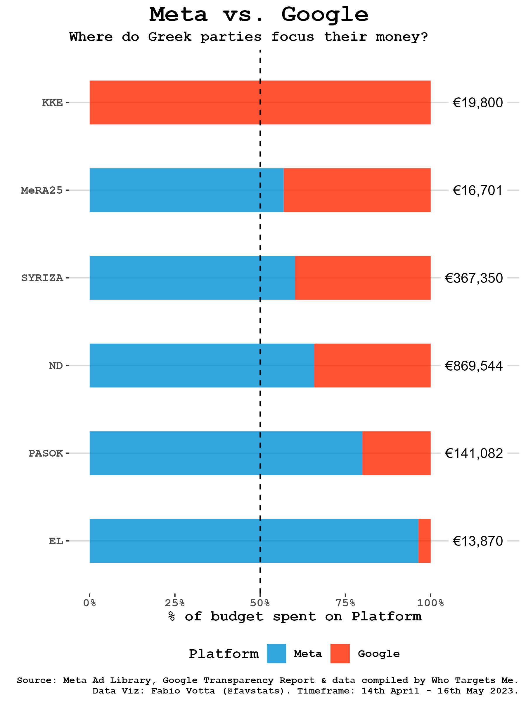

<style>
    body .main-container {
        max-width: 1920px !important;
    }
</style>


```{r setup, include=FALSE}
## Global options
knitr::opts_chunk$set(
    cache = F, 
    echo = F, 
    warning = F, 
    message = F, 
    cache.lazy = FALSE
)


# pacman::p_load(tidyverse, highcharter)
library(tidyverse)
library(highcharter)
library(gt)


options(scipen = 999)

library(tidyverse)

```


```{r}

color_dat <- tibble(colors = c("#5493ce", "#1b5cc7", "#01783d", "#ef3f24", "#ee808f"),
                    party = c("EL", "ND", "PASOK", "MeRA25", "SYRIZA"))


scale_fill_parties <- function(...){
    ggplot2:::manual_scale(
        'fill', 
        values = setNames(color_dat$colors, color_dat$party), 
        ...
    )
}
scale_color_parties <- function(...){
    ggplot2:::manual_scale(
        'color', 
        values = setNames(color_dat$colors, color_dat$party), 
        ...
    )
}

```


```{r}
election_dat30 <- readRDS("data/election_dat30.rds") %>% 
    rename(internal_id = page_id)  %>% 
  mutate(party = case_when(
    str_detect(party, "ΠΑΣΟΚ")  ~ "PASOK",
    str_detect(party, "ΝΔ")  ~ "ND",
    str_detect(party, "Συνασπισμός Ριζοσπαστικής Αριστεράς")  ~ "SYRIZA",
    str_detect(party, "ΕΛ")  ~ "EL",
    str_detect(party, "25")  ~ "MeRA25",
    T ~ party  )) %>% 
  mutate(party = case_when(
    str_detect(page_name, "Νίκος Συρμαλένιος") ~ "SYRIZA",
    # str_detect(page_name, "Stefanos Tyros") ~ "Volt",
    # str_detect(page_name, "Πατριωτική Ένωση - Πρόδρομος Εμφιετζόγλου") ~ "Patriotic Union",
    T ~ party 
  )) %>% 
  filter(!(party %in% c("GOV", "OTHER", "ΠΕ")))


election_dat7 <- readRDS("data/election_dat7.rds") %>% 
    rename(internal_id = page_id)   %>% 
  mutate(party = case_when(
    str_detect(party, "ΠΑΣΟΚ")  ~ "PASOK",
    str_detect(party, "ΝΔ")  ~ "ND",
    str_detect(party, "Συνασπισμός Ριζοσπαστικής Αριστεράς")  ~ "SYRIZA",
    str_detect(party, "ΕΛ")  ~ "EL",
    str_detect(party, "25")  ~ "MeRA25",
    T ~ party  )) %>% 
  mutate(party = case_when(
    str_detect(page_name, "Νίκος Συρμαλένιος") ~ "SYRIZA",
    # str_detect(page_name, "Stefanos Tyros") ~ "Volt",
    # str_detect(page_name, "Πατριωτική Ένωση - Πρόδρομος Εμφιετζόγλου") ~ "Patriotic Union",
    T ~ party 
  )) %>% 
  filter(!(party %in% c("GOV", "OTHER", "ΠΕ")))

# saveRDS(election_dat30, "data/election_dat30.rds")
# saveRDS(election_dat7, "data/election_dat7.rds")

fin <- (as.Date(election_dat30$ds[1])-lubridate::days(1))
begin7 <- fin-lubridate::days(6)
begin30 <- fin-lubridate::days(29)

append_date_suffix <- function(dates){
  dayy <- lubridate::day(dates)
  suff <- case_when(dayy %in% c(11,12,13) ~ "th",
                    dayy %% 10 == 1 ~ 'st',
                    dayy %% 10 == 2 ~ 'nd',
                    dayy %% 10 == 3 ~'rd',
                    TRUE ~ "th")
  paste0(dayy, suff)
}

create_date <- function(x) {
    the_date <- format(x, "%b %d")
    the_date <- ifelse(str_detect(the_date, " 0"),
           str_remove(the_date, "0"),
           the_date)
    str_replace(the_date, 
                as.character(lubridate::day(x)), 
                append_date_suffix(x))
}


last7days_string <- paste0(create_date(begin7), " - ", paste(create_date(fin), lubridate::year(fin)))
last30days_string <- paste0(create_date(begin30), " - ", paste(create_date(fin), lubridate::year(fin)))

source("utils.R")
```


## {.unlisted .unnumbered .tabset .tabset-fade .tabset-pills}

### Methodology

In collaboration with [Who Targets Me](https://whotargets.me/), we monitored over 300 political advertisers in Greece during the 2023 Greek parliamantary election to better understand how campaigns use different targeting methods made available by Meta. To do this, we used data from the [Meta Ad Library](https://www.facebook.com/ads/library/), using the new 'Audience' data which gives some detail on how pages target their ads. 

To better understand the election, we kept only advertisers who:

1. Advertised in the last 7 days (`r last7days_string`)
2. Advertised in the last 30 days (`r last30days_string`)

> Note: Meta only provides 7, 30 and 90 days windows for the targeting data in their Ad Library. Meta's data also lags by a few days. We will update this report as soon as new data is available.

We also include spending data from the [Google Transparency Report](https://transparencyreport.google.com/political-ads/region/GR), however the data on targeting criteria reported here exclusively refers to Meta platforms.

### About Us


```{r, echo=F}
library(htmltools)
library(bs4cards)


cards <- function(title, text, link, image) {
  div(class = "card",
      div(class = "card-body pb-5",
          h6(class = "card-title mb-0", title)),
      img(class = "card-img-top", src = image, style="object-fit: cover; height: 200px; width: 100%;"),
          p(class = "card-text", text),
          a(href = link, class = "btn btn-primary", "Link"))
}

div(class = "row",
    div(class = "col-sm-6 col-md-4",
        cards(
          "Alexandros Gotinakos",
          "Predoctoral researcher for the ActEU project at Aristotle University of Thessaloniki. Interested in comparative political behavior, political psychology, and survey methodology.",
          "https://twitter.com/gotinakos",
          "img/5frKLhQ0.png"
        )
    ),
    div(class = "col-sm-6 col-md-4",
        cards(
          "Fabio Votta",
          "Ph.D. candidate in Political Communication at the University of Amsterdam who studies (online) political microtargeting and its usage around the world.",
          "https://twitter.com/favstats",
          "https://www.uva.nl/binaries/_ht_1677599571673/cardmedium/content/gallery/personen/v/o/fabio-votta.jpg"
        )
    ),
    div(class = "col-sm-6 col-md-4",
        cards(
          "Who Targets Me",
          "Grassroots activist group advocating for transparency in the digital age by monitoring political adverts on social media and their impact on democracy.",
          "#",
          "https://whotargets.me/wp-content/uploads/2020/06/wtm_logo_2020.png"
        )
    )
)

```


## Topline Statistics  {.tabset .tabset-fade .tabset-pills}

```{r}

total_spend_id <- election_dat30 %>% 
    filter(main_currency == "EUR") %>% 
  distinct(internal_id, .keep_all = T) %>% 
  group_by(party) %>% 
  summarize(total_spend_formatted = sum(total_spend_formatted)) %>% 
  ungroup() 
```


```{r}
sum30 <- election_dat30 %>% 
    filter(main_currency == "EUR") %>% 
    distinct(internal_id, .keep_all = T) %>% 
    summarize(total_spend_formatted = sum(total_spend_formatted),
              total_num_ads = sum(total_num_ads))

sum7 <- election_dat7 %>% 
    filter(main_currency == "EUR") %>% 
    distinct(internal_id, .keep_all = T) %>% 
    summarize(total_spend_formatted = sum(total_spend_formatted),
              total_num_ads = sum(total_num_ads))

add_ribbons <- function(x, adv, col) {
   x %>% 
  # tab_options(table.width = pct(100)) %>%
  tab_style(
    style = cell_borders(
      sides = c("left"),
      color = col,
      weight = px(18.5),
      style = "solid"
    ),
    locations = cells_body(
      columns = `Number of Advertisers`,
      rows = adv
    ))
}

add_ribbons2 <- function(x, adv, col) {
   x %>% 
  # tab_options(table.width = pct(100)) %>%
  tab_style(
    style = cell_borders(
      sides = c("left"),
      color = col,
      weight = px(18.5),
      style = "solid"
    ),
    locations = cells_body(
      columns = `Number of Ads`,
      rows = adv
    ))
}
```


### Meta {.tabset .tabset-fade .tabset-pills}

#### Daily Spend


```{r, out.width="100%"}
# more_data %>% 
#   mutate(under100 = spend == 50)  %>% 
#     left_join(nl_advertisers %>% rename(advertiser_id = page_id) %>% 
#                   select(advertiser_id, party))  %>% 
#   filter(under100) %>% 
#   filter(party == "VVD")

  # filter(under100) %>% 
  #   drop_na(party) %>%
  #   group_by(party) %>% 
  #   summarize(spend  = sum(spend)) %>% 
  #   ungroup()
  # 
  # 
  # group_by(party) %>% 
  # add_count(under100) %>% 
  # ungroup() %>% 
  # filter()
  # 
  # count(under100)

# nl_advertisers %>% 
#     filter(party == "SP")

# nlsb %>% 
#     janitor::clean_names() %>% 
#     bind_rows(more_data) %>% 
#     left_join(nl_advertisers %>% rename(advertiser_id = page_id) %>% 
#                   select(advertiser_id, party)) %>% 
#     drop_na(party) %>%
#     group_by(date_produced, party) %>% 
#     summarize(spend  = sum(spend)) %>% 
#     ungroup() %>% 
#     # group_by(party) %>% 
#     # arrange(date_produced) %>% 
#     # mutate(spend = cumsum(spend)) %>% 
#     # filter(party == "SP")
#     ggplot(aes(date_produced, spend, color = party)) +
#     geom_line(size = 1.5) +
#     scale_color_parties() +
#     facet_wrap(~party, ncol = 3) +
#     ggthemes::theme_hc() +
#     theme(legend.position = "none") +
#     labs(y = "Daily Spend in Euro", x = "Day")

# plotly::ggplotly(ht)

# library(highcharter)

# nlsb %>% 
#     janitor::clean_names() %>% 
#     bind_rows(more_data) %>% 
#     left_join(nl_advertisers %>% rename(advertiser_id = page_id) %>% 
#                   select(advertiser_id, party)) %>% 
#     drop_na(party) %>%
#     group_by(date_produced, party) %>% 
#     summarize(spend  = sum(spend)) %>% 
#     ungroup() %>% 
#   filter(date_produced >= as.Date("2023-03-08"))  %>% 
#   clipr::write_clip()
#   hchart('area', hcaes(x = 'date_produced', y = 'spend', group = "party"))

## start here

more_data <- dir("data/reports", full.names = T) %>%
  
    map_dfr(~{#print(.x)
        yo <- read.csv(.x) %>% mutate(path = .x)
        return(yo)
            }) %>%
    mutate(date_produced = str_remove_all(path, "data/reports/FacebookAdLibraryReport_|_GR_yesterday_advertiser\\.csv")) %>%
    mutate(date_produced = lubridate::ymd(date_produced)) %>%
  drop_na(date_produced) %>% 
    janitor::clean_names()%>% #rename(advertiser_id = page_id) %>%
    mutate(spend = readr::parse_number(amount_spent_eur)) %>%
    mutate(spend = ifelse(spend == 100, 1, spend)) %>%
    # distinct(page_id, .keep_all = T) %>%
    filter(str_detect(page_name, "Global Space Conference on Climate Change|de Alliantie|PvdA - GroenLinks", negate = T)) %>%
    mutate(page_id = as.character(page_id))

# me_advertisers <- read_csv("data/wtm-advertisers-gr-2023-05-20T08_49_00.571Z.csv")
hc_data <-  more_data %>%
  # mutate(advertiser_id = as.character(advertiser_id)) %>%
    left_join(election_dat30 %>%
                distinct(internal_id, party) %>% 
                  select(page_id = internal_id, party)) %>%
    drop_na(party) %>%
    group_by(date_produced, party) %>%
    summarize(spend  = sum(spend)) %>%
    ungroup() %>%
  # spread(key = party, value = spend, fill = 0) %>%
  # arrange(date_produced) %>%
  # mutate(across(starts_with("50PLUS"):(last_col()), ~cumsum(.), .names = "cumulative_{.col}")) %>%
  # select(date_produced, starts_with("cumulative")) %>%
  # rename_with(~str_remove(., "cumulative_"), starts_with("cumulative")) %>%
  # pivot_longer(-date_produced, names_to = "party", values_to = "spend")  %>%
  group_by(party) %>%
  mutate(total_spend = max(spend)) %>%
  ungroup()  %>%
  left_join(color_dat, by = "party") %>%
  mutate(party = as.factor(party)) %>%
  mutate(party = fct_reorder(party, total_spend))

saveRDS(hc_data, "data/hc_data.rds")

color_order <- hc_data %>%
  distinct(party, .keep_all = T) %>%
  arrange(party) %>%
  pull(colors)


hc_data %>%
  mutate(`Daily Spend` = spend) %>%
  mutate(Date = date_produced) %>%
  hchart("area", hcaes(x = Date, y = `Daily Spend`, group = party, fill = colors)) %>%
  hc_plotOptions(    area = list(
      stacking = "normal",
      lineWidth = 1,
      marker = list(enabled = FALSE)
    )) %>%
  # hc_legend(share = TRUE)%>%
  hc_colors(color_order)%>%
  hc_tooltip(
    shared = TRUE,
    positioner = JS("function (labelWidth, labelHeight, point) {
        return { x: 200, y: this.chart.plotTop };
    }")
  )
# hc_colors(levels(hc_data$party))
# hc_colors(color_dat$colors[as.character(unique(hc_data$party))])

# color_dat$colors[levels(hc_data$party)]

# more_data %>% 
#   count(date_produced)

```


#### `r last30days_string` (Last 30 days)


In total, political parties spend €`r scales::comma_format()(sum30$total_spend_formatted)` and ran `r sum30$total_num_ads` ad copies on Meta in this timeframe.


```{r}

get_table_dat <- function(x, var) {
    

x %>% 
    filter(main_currency == "EUR") %>% 
        distinct(internal_id, .keep_all = T) %>% 
    group_by({{ var }}) %>% 
    summarize(total_num_ads = n()) %>% 
    drop_na() %>% 
    mutate(total_num_ads = scales::comma(total_num_ads)) %>%
    pivot_wider(names_from = {{ var }}, values_from = total_num_ads) %>% 
    mutate(`Coalizione/Partito` = "Number of Advertisers") %>% 
    bind_rows(x %>% 
    filter(main_currency == "EUR") %>% 
        distinct(internal_id, .keep_all = T) %>% 
        group_by({{ var }}) %>% 
        arrange(desc(total_spend_formatted)) %>% 
        slice(1:3) %>% 
        mutate(total_spend_formatted = scales::comma(total_spend_formatted)) %>%
        mutate(n_words = str_count(page_name, " ")) %>% 
        # mutate(lab = paste0(word(str_remove(page_name, "-"), 1,ifelse(n_words>=2, 3, 2), sep=" "), "<br>(€", total_spend_formatted, ")")) %>% 
        mutate(lab = paste0(page_name, " (€", total_spend_formatted, ")")) %>%
        select({{ var }}, lab) %>% 
        drop_na() %>% 
        summarize(lab = paste0("<br>", 1:n(), ". ", lab, collapse = "")) %>% 
        pivot_wider(names_from = {{ var }}, values_from = lab) %>% 
        mutate(`Coalizione/Partito` = "Top Spenders"))  %>% 
    bind_rows(
        x %>% 
            distinct(internal_id, .keep_all = T) %>% 
            group_by({{ var }}) %>% 
            summarize(total_num_ads = sum(total_num_ads)) %>% 
            drop_na() %>% 
            mutate(total_num_ads = scales::comma(total_num_ads)) %>% 
            pivot_wider(names_from = {{ var }}, values_from = total_num_ads) %>% 
            mutate(`Coalizione/Partito` = "Number of Ads")) %>% 
    bind_rows(
        x %>% 
            distinct(internal_id, .keep_all = T) %>% 
            group_by({{ var }}) %>% 
            summarize(total_spend_formatted = sum(total_spend_formatted)) %>% 
            mutate(total_spend_formatted = scales::comma(total_spend_formatted)) %>% 
        mutate(total_spend_formatted = paste0("€", total_spend_formatted)) %>% 
            drop_na() %>% 
            pivot_wider(names_from = {{ var }}, values_from = total_spend_formatted) %>% 
            mutate(`Coalizione/Partito` = "Total Spend") ) %>% 
    t() %>% 
    as.data.frame() %>% 
    rownames_to_column("Coalizione/Partito") %>% 
    set_names(.[nrow(.),] %>% as.character()) %>% 
    slice(1:(n()-1)) 
    
}

# debugonce(get_table_dat)
get_table_dat(election_dat30, party) %>% 
  arrange(desc(parse_number(`Total Spend`))) %>% 
  gt(
    rowname_col = "Coalizione/Partito"
    # groupname_col = "group"
  ) %>% 
  fmt_markdown(columns = everything())  %>% 
  cols_align(
    align = "center"
  ) %>% 
  gtExtras::gt_theme_538() %>%
add_ribbons("EL", "#5493ce") %>%
add_ribbons("ND", "#1b5cc7") %>%
add_ribbons("PASOK", "#01783d") %>%
add_ribbons("MeRA25", "#ef3f24") %>%
add_ribbons("SYRIZA", "#ee808f") 


# election_dat30 %>% count(party, sort = T)
```


#### `r last7days_string` (Last 7 days)

In total, political parties spend €`r scales::comma_format()(sum7$total_spend_formatted)` and ran `r sum7$total_num_ads` ad copies on Meta in this timeframe.


```{r}

get_table_dat(election_dat7, party) %>% 
  arrange(desc(parse_number(`Total Spend`))) %>% 
  gt(
    rowname_col = "Coalizione/Partito"
    # groupname_col = "group"
  ) %>% 
  fmt_markdown(columns = everything())  %>% 
  cols_align(
    align = "center"
  ) %>% 
  gtExtras::gt_theme_538() %>% 
  tab_options(table.width = pct(100)) %>%
add_ribbons("EL", "#5493ce") %>%
add_ribbons("ND", "#1b5cc7") %>%
add_ribbons("PASOK", "#01783d") %>%
add_ribbons("MeRA25", "#ef3f24") %>%
add_ribbons("SYRIZA", "#ee808f") 

```

### Google {.tabset .tabset-fade .tabset-pills}


```{r, fig.width=12, fig.height=8, dpi=300}
# ggl_daily <- readRDS("data/daily_spending.rds")
ggl_spend <- readRDS("data/ggl_spend.rds")


# plotly::ggplotly(ht)
 
 
  # ggl_daily %>%
  #   rename(Advertiser_ID = advertiser_id) %>%
  #   left_join(ggl_spend %>% distinct(Advertiser_ID, party1)) %>% 
  #   janitor::clean_names()  %>% 
  #   rename(party = party1) %>% 
  #   mutate(date_produced = lubridate::ymd(date)) %>%
  #   mutate(spend = readr::parse_number(str_remove(eur_amount, "\\."))) %>%  
  #   group_by(date_produced, party) %>% 
  #   summarize(spend  = sum(spend)) %>% 
  #   ungroup() %>% 
  #  mutate(party = ifelse(party == "JA21", "Ja21", party)) %>% 
  #   group_by(party) %>% 
  #   summarize(spend = sum(spend))
```

For Google platforms, data accessed via the [Google Transparency Report](https://transparencyreport.google.com/political-ads/region/GR) provides exact spending on how much money was spent by parties in last 30 and 7 days.

```{r}
ggl_all <- readRDS("data/ggl_all.rds")
ggl_all7 <- readRDS("data/ggl_all7.rds")

sum30_ggl <- ggl_all %>% 
    mutate(total_spend_formatted = parse_number(`Total Spend`)) %>% 
    # distinct(internal_id, .keep_all = T) %>% 
    summarize(total_spend_formatted = sum(total_spend_formatted),
              total_num_ads = sum(as.numeric(`Number of Ads`)))

sum7_ggl <- ggl_all7 %>% 
    mutate(total_spend_formatted = parse_number(`Total Spend`)) %>% 
    # distinct(internal_id, .keep_all = T) %>% 
    summarize(total_spend_formatted = sum(total_spend_formatted),
              total_num_ads = sum(as.numeric(`Number of Ads`)))

```


#### `r last30days_string` (Last 30 days)


In total, political parties spend €`r scales::comma_format()(sum30_ggl$total_spend_formatted)` and ran `r sum30_ggl$total_num_ads` ad copies on Google in this timeframe.

```{r}

ggl_all %>% 
  arrange(desc(parse_number(`Total Spend`))) %>% 
  gt(
    rowname_col = "Coalizione/Partito"
    # groupname_col = "group"
  ) %>% 
  fmt_markdown(columns = everything())  %>% 
  cols_align(
    align = "center"
  ) %>% 
  gtExtras::gt_theme_538() %>% 
  tab_options(table.width = pct(100)) %>%
add_ribbons2("EL", "#5493ce") %>%
add_ribbons2("ND", "#1b5cc7") %>%
add_ribbons2("PASOK", "#01783d") %>%
add_ribbons2("MeRA25", "#ef3f24") %>%
add_ribbons2("SYRIZA", "#ee808f")  %>%
add_ribbons2("KKE", "darkred") 
```

#### `r last7days_string` (Last 7 days)

In total, political parties spend €`r scales::comma_format()(sum7_ggl$total_spend_formatted)` and ran `r sum7_ggl$total_num_ads` ad copies on Google in this timeframe.


```{r}
ggl_all7 %>% 
  arrange(desc(parse_number(`Total Spend`))) %>% 
  gt(
    rowname_col = "Coalizione/Partito"
    # groupname_col = "group"
  ) %>% 
  fmt_markdown(columns = everything())  %>% 
  cols_align(
    align = "center"
  ) %>% 
  gtExtras::gt_theme_538() %>% 
  tab_options(table.width = pct(100)) %>%
add_ribbons2("EL", "#5493ce") %>%
add_ribbons2("ND", "#1b5cc7") %>%
add_ribbons2("PASOK", "#01783d") %>%
add_ribbons2("MeRA25", "#ef3f24") %>%
add_ribbons2("SYRIZA", "#ee808f")  %>%
add_ribbons2("KKE", "darkred") 
```


### Combined Stats

```{r}
bothsum30<- sum30 %>% 
  bind_rows(sum30_ggl) %>% 
  summarize(total_spend_formatted = sum(total_spend_formatted),
            total_num_ads = sum(total_num_ads))

```


In total, political parties spend €`r scales::comma_format()(bothsum30$total_spend_formatted)` and ran `r bothsum30$total_num_ads` ad copies on Google and Meta in the last 30 days (of available data).


The graph below shows how spending differed between Meta and Google platforms. In each row on the right hand side, you can see how much in total was spend by each party across both platforms.


<!-- #### Meta vs. Google -->




## Spending per Targeting Criteria {.tabset .tabset-fade .tabset-pills}

How much did campaigns spend on different targeting methods? The graphs below show spending *overall* across all parties and *by party*.

> Note: targeting criteria can overlap so the percentages do not sum up to 100%.


### `r last30days_string` (Last 30 days) {.tabset .tabset-fade .tabset-pills}


#### Overall


```{r, fig.width=8, fig.height=5, dpi=300}
coltototal30 <- election_dat30 %>% 
    mutate(total_spend = total_spend_formatted) %>% 
    filter(main_currency == "EUR") %>% 
        calc_targeting() 

gg <- coltototal30 %>% 
  filter(perc >= 0.01) %>%
  add_count(target) %>% 
  # filter(n == 3) %>% 
  mutate(target = case_when(
    target == "custom_audience" ~ "Custom Audiences",
    target == "countries" ~ "GEOGRAPHY: Entire Country",
    target == "regions" ~ "GEOGRAPHY: Regions",
    target == "lookalike_audience" ~ "Lookalike Audiences",
    target == "interest" ~ "Detailed",
    target == "age" ~ "Age",
    target == "zips" ~ "GEOGRAPHY: Postal Code",
    target == "CITY" ~ "GEOGRAPHY: City",
    target == "language" ~ "Language",
    target == "gender" ~ "Gender",
    target == "COMUNE" ~ "GEOGRAPHY: Municipality",
    target == "electoral_districts" ~ "GEOGRAPHY: Electoral Districts",
    target == "COUNTY" ~ "GEOGRAPHY: Counties",
    str_detect(target, "NEIGHBOR") ~ "GEOGRAPHY: Neighborhood",
    T ~ target
  )) %>% 
    filter(target != "Unknown") %>% 
    arrange(desc(perc))  #%>% 
    # mutate(coalition = fct_relevel(coalition, c("Coalizione di centro-sinistra",
    #                               "Terzo Polo",
    #                               "Coalizione di centro-destra")))

library(tidytext)

the_order <- gg %>% 
    complete(target, fill = list(perc= 0)) %>% 
    # filter(coalition == "Coalizione di centro-sinistra")  %>% 
    mutate(target = fct_reorder(target, perc, .desc = F)) %>% 
    pull(target) %>% levels

gg %>% 
    mutate(target = fct_relevel(target, the_order)) %>%
    # mutate(target = reorder_within(target, perc)) %>%
    ggplot(aes(target, perc)) +
    geom_col(fill = "darkgrey", alpha = 0.7) +
    # scale_x_reordered() +
    coord_flip() +
    # facet_wrap(~party, scales = "free", ncol = 3) +
    ggthemes::theme_hc() +
    # scale_fill_manual(values = c("#ef3e3e", "#0039aa", "#0a6be1"))   +
  geom_text(size = 2.5,
             aes(y = perc + 3, label = paste0(round(perc, 1), "%")),
             position = position_dodge(width = 0.9)) +
  theme(legend.position = "none", text=element_text(family="mono", face = "bold")) +
  labs(x = "", y = "\nBudget spent on targeting method (% of Total spend)", caption = "Source: Meta Ad Library. Data Viz: Fabio Votta (@favstats).") 


```


#### By Party


```{r, fig.width=12, fig.height=9, dpi=300}


col_each30 <- election_dat30 %>% 
    mutate(total_spend = total_spend_formatted) %>% 
    filter(main_currency == "EUR") %>% 
    group_split(party) %>% 
    map_dfr(~{
        calc_targeting(.x) %>% 
            mutate(#coalition = .x$coalition[1],
                   party = .x$party[1])
    })


plot_geography <- function(x) {
    
gg <- x %>% 
  filter(perc >= 0.01) %>%
  add_count(target) %>% 
  # filter(n == 3) %>% 
  mutate(target = case_when(
    target == "custom_audience" ~ "Custom Audiences",
    target == "countries" ~ "GEOGRAPHY: Entire Country",
    target == "regions" ~ "GEOGRAPHY: Regions",
    target == "lookalike_audience" ~ "Lookalike Audiences",
    target == "interest" ~ "Detailed",
    target == "age" ~ "Age",
    target == "zips" ~ "GEOGRAPHY: Postal Code",
    target == "CITY" ~ "GEOGRAPHY: City",
    target == "language" ~ "Language",
    target == "gender" ~ "Gender",
    target == "COMUNE" ~ "GEOGRAPHY: Municipality",
    target == "electoral_districts" ~ "GEOGRAPHY: Electoral Districts",
    target == "COUNTY" ~ "GEOGRAPHY: Counties",
    str_detect(target, "NEIGHBOR") ~ "GEOGRAPHY: Neighborhood",
    T ~ target
  )) %>% 
    filter(target != "Unknown") %>% 
    arrange(desc(perc))  #%>% 
    # mutate(coalition = fct_relevel(coalition, c("Coalizione di centro-sinistra",
    #                               "Terzo Polo",
    #                               "Coalizione di centro-destra")))

the_order <- gg %>% 
    complete(party, target, fill = list(perc= 0)) %>% 
    # filter(coalition == "Coalizione di centro-sinistra")  %>% 
    mutate(target = fct_reorder(target, perc, .desc = F)) %>% 
    pull(target) %>% levels

gg %>% 
    # mutate(target = fct_relevel(target, the_order)) %>%
    mutate(target = reorder_within(target, perc, party)) %>% 
    ggplot(aes(target, perc)) +
    geom_col(aes(fill = party)) +
    scale_x_reordered() +
    coord_flip() +
    facet_wrap(~party, scales = "free", ncol = 3) +
    ggthemes::theme_hc() +
    # scale_fill_manual(values = c("#ef3e3e", "#0039aa", "#0a6be1"))   +
  geom_text(size = 2.5,
             aes(y = perc + 9, label = paste0(round(perc, 1), "%"), group = party),
             position = position_dodge(width = 0.9)) +
  theme(legend.position = "none", text=element_text(family="mono", face = "bold")) +
  labs(x = "", y = "\nBudget spent on targeting method (% of Total spend)", caption = "Source: Meta Ad Library. Data Viz: Fabio Votta (@favstats).") +
    ylim(0, 100)

}

library(tidytext)
plot_geography(col_each30) +
    scale_fill_parties()

```


### `r last7days_string` (Last 7 days)  {.tabset .tabset-fade .tabset-pills}


#### Overall


```{r, fig.width=8, fig.height=5, dpi=300}
coltototal7 <- election_dat7 %>% 
    mutate(total_spend = total_spend_formatted) %>% 
    filter(main_currency == "EUR") %>% 
        calc_targeting() 

gg <- coltototal7 %>% 
  filter(perc >= 0.01) %>%
  add_count(target) %>% 
  # filter(n == 3) %>% 
  mutate(target = case_when(
    target == "custom_audience" ~ "Custom Audiences",
    target == "countries" ~ "GEOGRAPHY: Entire Country",
    target == "regions" ~ "GEOGRAPHY: Regions",
    target == "lookalike_audience" ~ "Lookalike Audiences",
    target == "interest" ~ "Detailed",
    target == "age" ~ "Age",
    target == "zips" ~ "GEOGRAPHY: Postal Code",
    target == "CITY" ~ "GEOGRAPHY: City",
    target == "language" ~ "Language",
    target == "gender" ~ "Gender",
    target == "COMUNE" ~ "GEOGRAPHY: Municipality",
    target == "electoral_districts" ~ "GEOGRAPHY: Electoral Districts",
    target == "COUNTY" ~ "GEOGRAPHY: Counties",
    str_detect(target, "NEIGHBOR") ~ "GEOGRAPHY: Neighborhood",
    T ~ target
  )) %>% 
    filter(target != "Unknown") %>% 
    arrange(desc(perc))  #%>% 
    # mutate(coalition = fct_relevel(coalition, c("Coalizione di centro-sinistra",
    #                               "Terzo Polo",
    #                               "Coalizione di centro-destra")))

library(tidytext)

the_order <- gg %>% 
    complete(target, fill = list(perc= 0)) %>% 
    # filter(coalition == "Coalizione di centro-sinistra")  %>% 
    mutate(target = fct_reorder(target, perc, .desc = F)) %>% 
    pull(target) %>% levels

gg %>% 
    mutate(target = fct_relevel(target, the_order)) %>%
    # mutate(target = reorder_within(target, perc)) %>%
    ggplot(aes(target, perc)) +
    geom_col(fill = "darkgrey", alpha = 0.7) +
    # scale_x_reordered() +
    coord_flip() +
    # facet_wrap(~party, scales = "free", ncol = 3) +
    ggthemes::theme_hc() +
    # scale_fill_manual(values = c("#ef3e3e", "#0039aa", "#0a6be1"))   +
  geom_text(size = 2.5,
             aes(y = perc + 3, label = paste0(round(perc, 1), "%")),
             position = position_dodge(width = 0.9)) +
  theme(legend.position = "none", text=element_text(family="mono", face = "bold")) +
  labs(x = "", y = "\nBudget spent on targeting method (% of Total spend)", caption = "Source: Meta Ad Library. Data Viz: Fabio Votta (@favstats).") 


```


#### By Party

```{r, fig.width=12, fig.height=9, dpi=300}

col_each7 <- election_dat7 %>% 
    mutate(total_spend = total_spend_formatted) %>% 
    filter(main_currency == "EUR") %>% 
    group_split(party) %>% 
    map_dfr(~{
        calc_targeting(.x) %>% 
            mutate(#coalition = .x$coalition[1],
                   party = .x$party[1])
    })


plot_geography(col_each7) +
    scale_fill_parties()

```

## Top Targeted (Detailed) Audiences {.tabset .tabset-fade .tabset-pills}

Here, we show the *top targeted audiences* for each party for the "detailed" targeting that Meta offers (ranked by amount of Euro spend). Most (but not all) of these audiences are “interest” audiences, i.e. the parties targeted people interested in “Books” or “Politics”.

```{r}

interest_targeting30 <-  election_dat30 %>% 
    mutate(total_spend = total_spend_formatted) %>% 
    filter(type == "detailed") %>%
    # mutate(total_spend = readr::parse_number(total_spend_formatted)) %>%
    mutate(total_spend = ifelse(total_spend == 50, 1, total_spend)) %>%
    mutate(total_spend = total_spend * total_spend_pct) %>%
    filter(main_currency == "EUR")  %>%
    # left_join(page_names %>% select(internal_id = page_id, page_name) %>% distinct(internal_id, .keep_all =T)) %>%
    # left_join(us_advertisers %>% rename(internal_id = page_id)) %>%
    # drop_na(left_vs_right) %>%
    mutate(value = paste0(detailed_type,": ", value)) %>% 
    group_by(party, value, is_exclusion, detailed_type) %>%
    summarise(total_spend = sum(total_spend)) %>%
    ungroup() %>%
    arrange(desc(total_spend)) 

# election_dat30 %>% 
#     filter(!is_exclusion) %>% 
#     group_by(party)
#     ggplot(aes())
    
contested_dat30 <- interest_targeting30 %>% 
  filter(!is_exclusion) %>% 
  # filter(total_spend >= 40000) %>% 
  filter(total_spend >= 1) %>%
  # add_count(value) %>% 
  # filter(n >= 5) %>% 
  group_by(party) %>% 
  mutate(total_spenderino = sum(total_spend)) %>% 
  mutate(perc = total_spend/total_spenderino) %>%
  mutate(value = str_remove_all(value, "INTERESTS: |DEMOGRAPHICS: |BEHAVIORS: ")) %>% 
  mutate(value = str_replace_all(value, " \\s*\\([^\\)]+\\)", ""))


interest_targeting7 <-  election_dat7 %>% 
    mutate(total_spend = total_spend_formatted) %>% 
    filter(type == "detailed") %>%
    # mutate(total_spend = readr::parse_number(total_spend_formatted)) %>%
    mutate(total_spend = ifelse(total_spend == 50, 1, total_spend)) %>%
    mutate(total_spend = total_spend * total_spend_pct) %>%
    filter(main_currency == "EUR")  %>%
    # left_join(page_names %>% select(internal_id = page_id, page_name) %>% distinct(internal_id, .keep_all =T)) %>%
    # left_join(us_advertisers %>% rename(internal_id = page_id)) %>%
    # drop_na(left_vs_right) %>%
    mutate(value = paste0(detailed_type,": ", value)) %>% 
    group_by(party, value, is_exclusion, detailed_type) %>%
    summarise(total_spend = sum(total_spend)) %>%
    ungroup() %>%
    arrange(desc(total_spend)) 

# election_dat30 %>% 
#     filter(!is_exclusion) %>% 
#     group_by(party)
#     ggplot(aes())
    
contested_dat7 <- interest_targeting7 %>% 
  filter(!is_exclusion) %>% 
  # filter(total_spend >= 40000) %>% 
  filter(total_spend >= 1) %>%
  # add_count(value) %>% 
  # filter(n >= 5) %>% 
  group_by(party) %>% 
  mutate(total_spenderino = sum(total_spend)) %>% 
  mutate(perc = total_spend/total_spenderino) %>%
  mutate(value = str_remove_all(value, "INTERESTS: |DEMOGRAPHICS: |BEHAVIORS: ")) %>% 
  mutate(value = str_replace_all(value, " \\s*\\([^\\)]+\\)", ""))

```

```{r,fig.width=9, fig.height=7,eval=F, dpi = 300, eval = F}
library(tidytext)
 interest_targeting30 %>% 
  filter(is_exclusion) %>% 
  # filter(total_spend >= 40000) %>% 
  filter(total_spend >= 1) %>%
  # add_count(value) %>% 
  # filter(n >= 5) %>% 
  group_by(party) %>% 
  mutate(total_spenderino = sum(total_spend)) %>% 
  mutate(perc = total_spend/total_spenderino)  %>%
      mutate(value = str_wrap(value, width = 20)) %>% 

    mutate(value = reorder_within(value, total_spend, party)) %>% 
    # filter(party == "BBB") %>%
    # slice(1:30) %>%
  # mutate(value = fct_reorder(value, total_spend)) %>% 
  ggplot(aes(value, total_spend)) +
  geom_col(aes(fill = party), width = 0.29) +
  coord_flip() +
  scale_fill_parties() +
  
    scale_x_reordered()  +
  ggthemes::theme_hc() +
  labs(x = "Exclusion criteria\n", y = "Budget spent on targeting method (in Euro)", #title = "Top Excluded Audiences by Party", subtitle = "On Meta you can exclude audiences that you don't want to see your ads\n", 
       caption = "\nSource: Meta Ad Library and data compiled by Who Targets Me. Data Viz: Fabio Votta (@favstats).") +
  theme(plot.title = element_text(size = 38, face = "bold", hjust = 0.5), text=element_text(family="mono", face = "bold"), plot.caption = element_text(), plot.subtitle = element_text(hjust = 0.5, size = 20)) +
  theme(legend.position = "none") +
  facet_wrap(~party, scales = "free")
```


### `r last30days_string` (Last 30 days)


```{r, fig.width=16, fig.height=8, dpi=300}
contested_dat30 %>% 
    group_by(party) %>%
    arrange(desc(perc)) %>% 
    slice(1:10) %>%
    mutate(value = reorder_within(value, total_spend, party)) %>% 
    ggplot(aes(value, total_spend, fill = party)) +
    geom_col() +
    facet_wrap(~party, scales = "free", ncol = 3)+
    coord_flip()  +
    scale_x_reordered() +
    scale_fill_parties() +
  ggthemes::theme_hc() +
  labs(x = "Targeting criteria", y = "Budget spent on targeting method (in Euro)", #title = "Contested targeted interests (US midterms 2022)", subtitle = " ", 
       caption = "Source: Meta Ad Library and data compiled by Who Targets Me. Data Viz: Fabio Votta (@favstats).") +
  theme(legend.position = "none", plot.title = element_text(size = 28, face = "bold", hjust = 1.25), text=element_text(family="mono", face = "bold")) +
  guides(fill=guide_legend(nrow=2,byrow=TRUE)) 
```


### `r last7days_string` (Last 7 days)

```{r, fig.width=16, fig.height=8, dpi=300}
contested_dat7 %>% 
    group_by(party) %>%
    arrange(desc(perc)) %>% 
    slice(1:10) %>%
    mutate(value = reorder_within(value, total_spend, party)) %>% 
    ggplot(aes(value, total_spend, fill = party)) +
    geom_col() +
    facet_wrap(~party, scales = "free", ncol = 3)+
    coord_flip()  +
    scale_x_reordered() +
    scale_fill_parties() +
  ggthemes::theme_hc() +
  labs(x = "Targeting criteria", y = "Budget spent on targeting method (in Euro)", #title = "Contested targeted interests (US midterms 2022)", subtitle = " ", 
       caption = "Source: Meta Ad Library and data compiled by Who Targets Me. Data Viz: Fabio Votta (@favstats).") +
  theme(legend.position = "none", plot.title = element_text(size = 28, face = "bold", hjust = 1.25), text=element_text(family="mono", face = "bold")) +
  guides(fill=guide_legend(nrow=2,byrow=TRUE)) 
```


## Top Contested Audiences {.tabset .tabset-fade .tabset-pills}

Here, we show the *top most contested audiences*, i.e. where all parties have spent considerable amounts of money competing to reach voters with the same interests. Most (but not all) of these audiences are “interest” audiences, i.e. the parties targeted people interested in “Books” or “Politics”. In each row on the right hand side, you can see how much in total was spend on that specific target audience.

### `r last30days_string` (Last 30 days)

```{r, fig.width  = 13, fig.height=15}


get_contested_graph <- function(ppp) {
    
    
interest_targeting <-  ppp %>% 
    mutate(total_spend = total_spend_formatted) %>% 
    filter(type == "detailed") %>%
    # mutate(total_spend = readr::parse_number(total_spend_formatted)) %>%
    mutate(total_spend = ifelse(total_spend == 50, 1, total_spend)) %>%
    mutate(total_spend = total_spend * total_spend_pct) %>%
    filter(main_currency == "EUR")  %>%
    # left_join(page_names %>% select(internal_id = page_id, page_name) %>% distinct(internal_id, .keep_all =T)) %>%
    # left_join(us_advertisers %>% rename(internal_id = page_id)) %>%
    # drop_na(left_vs_right) %>%
    mutate(value = paste0(detailed_type,": ", value)) %>% 
    group_by(party, value, is_exclusion, detailed_type) %>%
    summarise(total_spend = sum(total_spend)) %>%
    ungroup() %>%
    arrange(desc(total_spend)) 

contested_dat <- interest_targeting %>% 
  filter(!is_exclusion) %>% 
  # filter(total_spend >= 40000) %>% 
  filter(total_spend >= 500) %>%
  add_count(value) %>% 
  filter(n >= 2) %>% 
    # distinct(party, value) %>% 
  group_by(value) %>% 
  mutate(total_spenderino = sum(total_spend)) %>% 
  mutate(perc = total_spend/total_spenderino) %>%
  # mutate(value = str_remove_all(value, "INTERESTS: |DEMOGRAPHICS: |BEHAVIORS: ")) %>% 
  mutate(value = str_replace_all(value, " \\s*\\([^\\)]+\\)", ""))


the_order <- contested_dat %>% 
  filter(party == "ND") %>%   arrange(desc(perc)) %>% 
  pull(value) %>% 
  unique()

lab_dat <- contested_dat %>% 
  # distinct(value, .keep_all = T) %>% 
  filter(party == "ND") %>% 
  mutate(labb = paste0("€", scales::comma(round(total_spenderino)))) %>% 
  select(party, value, labb)


contested_dat %>% #count(party) %>% pull(party) %>% unique() %>% dput()
  # mutate(the_order = )
  left_join(lab_dat) %>% 
  mutate(value = factor(value, the_order)) %>% 
    drop_na(value) %>% 
    # add_count(party, value, name = "db") %>% 
    # filter(db == 1) %>% 
  # mutate(party = factor(party, col_string)) %>%
  # filter()
  ggplot(aes(value, perc)) +
  geom_col(aes(fill = party), position = position_stack(), alpha = 0.8) +
  coord_flip() +
  geom_label(aes(label = labb),y=1.225,
            position = position_stack(vjust = 0.5),
            hjust = 1, label.size = NA,
            size = 4) + expand_limits(y = 1.2) +
  geom_hline(yintercept = 0.5, linetype = "dashed") +
  scale_y_continuous(labels = scales::percent, breaks = c(0, 0.25, 0.5, 0.75, 1)) +
  # scale_fill_manual("Page Groups", values = c("#ff2700", "#008fd5")) +
  ggthemes::theme_hc() +
  labs(x = "Targeting criteria", y = "% of budget spent on targeting method", #title = "Contested targeted interests (US midterms 2022)", subtitle = " ", 
       caption = "Source: Meta Ad Library and data compiled by Who Targets Me. Data Viz: Fabio Votta (@favstats).") +
  theme(legend.position = "bottom", plot.title = element_text(size = 28, face = "bold", hjust = 1.25), text=element_text(family="mono", face = "bold")) +
  guides(fill=guide_legend(nrow=2,byrow=TRUE)) 
    
}


```


```{r, fig.width  = 11, fig.height=15}
# main_parties <- c("VVD", "FvD", "GroenLinks", "PvdA", "CDA", "SP", "PVV", "D66", "PvdD", "Ja21", "CDA")
# debugonce(get_contested_graph)
election_dat30 %>% 
    # filter(party %in% main_parties) %>% 
    # filter(!(party %in% remove_parties)) %>%
    get_contested_graph()  +
    scale_fill_parties()


```


### `r last7days_string` (Last 7 days)

```{r, fig.width  = 10, fig.height=15}

election_dat7 %>% 
    # filter(party %in% main_parties) %>% 
    # filter(!(party %in% remove_parties)) %>%
    get_contested_graph() +
    scale_fill_parties()
```

## Geographical Targeting {.tabset .tabset-fade .tabset-pills}

The graphs below show various kinds of *location targeting* that parties engaged in on Meta platforms.

> Note: targeting criteria can overlap so the percentages do not sum up to 100%.


### `r last30days_string` (Last 30 days) {.tabset .tabset-fade .tabset-pills}

#### Regions

```{r,fig.width=10, fig.height=8}
library(treemap)
region_dat <- election_dat30 %>%
  filter(type == "location") %>%
  filter(location_type == "regions") %>%
  filter(!is_exclusion)  %>%
  mutate(likely_together = paste0(total_spend_pct,num_ads) %>% as.factor() %>% as.numeric()) %>%
  group_by(internal_id) %>%
  add_count(likely_together, name = "n_clusters") %>%
  ungroup() %>%
  mutate(total_spend_formatted = total_spend_formatted*total_spend_pct) %>%
  mutate(total_spend_formatted = total_spend_formatted/n_clusters) %>%
  group_by(party, value) %>%
  summarise(total_spend_formatted = sum(total_spend_formatted),
            num_ads = sum(num_ads)) %>%
  ungroup() %>%
  rename(region = value) %>%
  mutate(region = str_remove_all(region, ", Greece")) 

the_colors <- region_dat %>% 
  group_by(party) %>% 
  summarize(total_spend_formatted = sum(total_spend_formatted)) %>% 
  ungroup() %>% 
  mutate(party = fct_relevel(party)) %>% 
  left_join(color_dat) %>% 
  arrange(party) %>% 
  drop_na(colors) %>% 
  pull(colors)

## Static version
tm <- treemap(region_dat, index = c("party", "region"),
              vSize = "total_spend_formatted", 
              vColor = "party",
              type = "index",
              title = "",
                  align.labels=list(
        c("right", "bottom"),
        c("center", "center")
        ),
                  fontsize.labels=c(21,10),                # size of labels. Give the size per level of aggregation: size for group, size for subgroup, sub-subgroups...

                  fontcolor.labels=c("white","white"),    # Color of labels
              palette = the_colors)


# read_csv("data/PoliticalAds.csv") %>% 
#   filter(CountryCode == "turkey")
#   count(CountryCode, sort = T)

```


#### Cities

```{r,fig.width=10, fig.height=8}
library(treemap)
region_dat <- election_dat30 %>%
  filter(type == "location") %>%
  filter(location_type == "CITY") %>%
  filter(!is_exclusion)  %>%
  mutate(likely_together = paste0(total_spend_pct,num_ads) %>% as.factor() %>% as.numeric()) %>%
  group_by(internal_id) %>%
  add_count(likely_together, name = "n_clusters") %>%
  ungroup() %>%
  mutate(total_spend_formatted = total_spend_formatted*total_spend_pct) %>%
  mutate(total_spend_formatted = total_spend_formatted/n_clusters) %>%
  group_by(party, value) %>%
  summarise(total_spend_formatted = sum(total_spend_formatted),
            num_ads = sum(num_ads)) %>%
  ungroup() %>%
  rename(region = value) %>%
  mutate(region = str_remove_all(region, ", Greece")) 

the_colors <- region_dat %>% 
  group_by(party) %>% 
  summarize(total_spend_formatted = sum(total_spend_formatted)) %>% 
  ungroup() %>% 
  mutate(party = fct_relevel(party)) %>% 
  left_join(color_dat) %>% 
  arrange(party) %>% 
  drop_na(colors) %>% 
  pull(colors)

## Static version
tm <- treemap(region_dat, index = c("party", "region"),
              vSize = "total_spend_formatted", 
              vColor = "party",
              type = "index",
              title = "",
                  align.labels=list(
        c("right", "bottom"),
        c("center", "center")
        ),
                  fontsize.labels=c(21,10),                # size of labels. Give the size per level of aggregation: size for group, size for subgroup, sub-subgroups...

                  fontcolor.labels=c("white","white"),    # Color of labels
              palette = the_colors)


```


#### Cities (Maps) {.tabset .tabset-fade .tabset-pills}

```{r, message=F, warning=F, eval = F}
    library(sf)
geo <- sf::st_read("data/geonames-all-cities-with-a-population-1000@public.geojson", quiet = T) 

geo_region <- sf::st_read("https://geodata.gov.gr/geoserver/wfs/?service=WFS&version=1.0.0&request=GetFeature&typeName=geodata.gov.gr:d7f50467-e5ef-49ac-a7ce-15df3e2ed738&outputFormat=application/json&srsName=epsg:2100")
  
    geo_transformed <- st_transform(geo, crs = 2100) # GGRS87 / Greek Grid corresponds to EPSG:2100
```


```{r, eval = F}
elex_dat %>% 
      # filter(name %in% c("Athens", "Thessaloniki", "Pátrai", "Piraeus", "Larissa", "Heraklion", "Kalamaria")) %>% 
  arrange(desc(perc)) %>% 
  filter(is.na(cou_name_en)) %>% 
  distinct(name, .keep_all = T)


library(tidygeocoder)

# geocode the addresses
lat_longs <- elex_dat %>% 
      # filter(name %in% c("Athens", "Thessaloniki", "Pátrai", "Piraeus", "Larissa", "Heraklion", "Kalamaria")) %>% 
  arrange(desc(perc)) %>% 
  filter(is.na(cou_name_en)) %>%
  geocode(value, method = 'osm', lat = latitude , long = longitude)

saveRDS(lat_longs, "data/lat_longs.rds")


lat_longs %>% 
  select(name, latitude, longitude) %>% 
  slice(1:10) %>% print


lat_longs_sf <- lat_longs %>%
  filter(!is.na(latitude) & !is.na(longitude)) %>%  # remove rows with NA coordinates
  st_as_sf(coords = c("longitude", "latitude"), crs = 4326) %>% 
  st_transform(crs = 2100)
  select(geometry, everything())# WGS 84

# Perform the spatial join
joined <- st_join(lat_longs_sf, elex_dat%>% 
  select(geometry, everything()))

saveRDS(lat_longs_sf, "data/lat_longs_sf.rds")
```

```{r, eval = F}
lat_longs <- readRDS("data/lat_longs.rds")

lat_longs_sf <- lat_longs %>%
  filter(!is.na(latitude) & !is.na(longitude)) %>%  # remove rows with NA coordinates
  st_as_sf(coords = c("longitude", "latitude"), crs = 4326) %>% 
  st_transform(crs = 2100)
  # select(geometry, everything())# WGS 84
# election_dat30 %>%
#   filter(location_type == "CITY") %>% 
#   mutate(name = str_remove(value, ", Greece")) %>% 
#   left_join(geo)
#   count(value, sort = T)
```


```{r}
total_sppppeen <- election_dat30 %>%
               filter(main_currency=="EUR") %>% 
        distinct(internal_id, .keep_all = T)  %>%
        # mutate(total_spend = readr::parse_number(total_spend_formatted)) %>%
        mutate(total_spend = ifelse(total_spend_formatted == 100, 1, total_spend_formatted)) %>%
        select(internal_id, total_spend, party) %>%
        arrange(desc(total_spend)) %>%
      group_by(party) %>% 
        summarize(totalooo = sum(total_spend)) %>% 
      ungroup()
```


```{r}
retrieve_maps <- function(partyyy) {
  elex_dat <- election_dat30 %>%
  filter(location_type == "CITY") %>%
  distinct(value) %>%
  mutate(name = str_remove(value, ",.*")) %>% 
  add_count(name) %>% 
  filter(n == 1) %>% 
  left_join(geo_transformed  %>% 
  add_count(name) %>% 
  filter(n == 1)) %>% 
  right_join(election_dat30 %>% 
               filter(main_currency=="EUR") %>% 
  filter(location_type == "CITY")  %>%
  mutate(total_spend = total_spend_formatted*total_spend_pct) %>% 
  group_by(party, value) %>% 
  summarize(total_spend = sum(total_spend)) %>% 
    ungroup() %>% 
    left_join(total_sppppeen) %>% 
    mutate(perc = total_spend/totalooo*100))  %>%
  bind_rows(lat_longs_sf, .) %>% 
  filter(party == partyyy) %>% 
  distinct(party, name, .keep_all = T)
  
  
  
geo_region %>% 
    ggplot(aes(geometry = geometry))  +
    theme_void() +
    # colorspace::scale_fill_binned_sequential(palette = "Peach",
            # na.value = "lightgrey")   +
    geom_sf(fill = "lightgrey", alpha = 0.5) +
    geom_sf(data =  elex_dat  %>% 
            arrange(perc), aes(geometry = geometry, color = perc, size = perc))  +
  # geom_sf(data = elex_dat %>% 
  #           arrange(perc), aes(geometry = geometry, color = perc, size = perc)) +
  # facet_wrap(~party) +
    colorspace::scale_color_binned_sequential(palette = "Viridis",
            na.value = "gray10") +
    theme(legend.position = "bottom")+ 
    guides(color = guide_colourbar(title = "% of Budget Spend", barwidth = 15, barheight = 0.5), size = NULL) + scale_size(guide = 'none')  +
  ggrepel::geom_text_repel(
    data = elex_dat %>%
      drop_na(cou_name_en) %>% 
      bind_rows(lat_longs_sf) %>% 
      filter(name %in% c("Athens", "Thessaloníki", "Larissa", "Heraklion", "Kalamaria")) %>% 
            #     group_by(party) %>%
            # arrange(-perc) %>% 
            #   slice(1:10) %>% 
            #   ungroup() %>% 
              distinct(name, .keep_all = T),
    aes(label = name, geometry = geometry),
    stat = "sf_coordinates", #max.overlaps = 1,
    min.segment.length = 0
  )

ggsave(paste0("img/", partyyy, "_maps.png"), width = 12, height = 12, dpi = 900, bg  = "white")

}


# geo_transformed %>% 
#   count(admin1_code, sort = T) %>% 
#   as_tibble()
```


```{r, eval = F}

# retrieve_maps("MeRA25")

c("ND", "SYRIZA", "PASOK", "EL", "MeRA25") %>%
walk(retrieve_maps)
# plot(geo_region)
# 
# geo %>%
#   slice(1) %>% 
#   pull(geometry)
# 
# geo_region %>%
#   slice(1) %>% 
#   pull(geometry)
# 
# 
#  elex_dat %>%
#       drop_na(cou_name_en) %>% 
#       bind_rows(lat_longs_sf) %>% 
#    arrange(desc(value))
```

##### ND


##### SYRIZA


##### PASOK


##### EL


##### ΜeRΑ25


## Geographical Exclusion {.tabset .tabset-fade .tabset-pills}

On Meta, political parties can also **exclude** certain geographical units. The graphs below show which locations were excluded from seeing political advertisements and how much money the parties spend on these ads.

### `r last30days_string` (Last 30 days) {.tabset .tabset-fade .tabset-pills}

<!-- #### Regions -->

```{r,fig.width=10, fig.height=8, eval = F}
library(treemap)
region_dat <- election_dat30 %>%
  filter(type == "location") %>%
  filter(location_type == "regions") %>%
  filter(is_exclusion)  %>%
  mutate(likely_together = paste0(total_spend_pct,num_ads) %>% as.factor() %>% as.numeric()) %>%
  group_by(internal_id) %>%
  add_count(likely_together, name = "n_clusters") %>%
  ungroup() %>%
  mutate(total_spend_formatted = total_spend_formatted*total_spend_pct) %>%
  mutate(total_spend_formatted = total_spend_formatted/n_clusters) %>%
  group_by(party, value) %>%
  summarise(total_spend_formatted = sum(total_spend_formatted),
            num_ads = sum(num_ads)) %>%
  ungroup() %>%
  rename(region = value) %>%
  mutate(region = str_remove_all(region, ", Greece")) 

the_colors <- region_dat %>% 
  group_by(party) %>% 
  summarize(total_spend_formatted = sum(total_spend_formatted)) %>% 
  ungroup() %>% 
  mutate(party = fct_relevel(party)) %>% 
  left_join(color_dat) %>% 
  arrange(party) %>% 
  drop_na(colors) %>% 
  pull(colors)

## Static version
tm <- treemap(region_dat, index = c("party", "region"),
              vSize = "total_spend_formatted", 
              vColor = "party",
              type = "index",
              title = "",
                  align.labels=list(
        c("right", "bottom"),
        c("center", "center")
        ),
                  fontsize.labels=c(21,10),                # size of labels. Give the size per level of aggregation: size for group, size for subgroup, sub-subgroups...

                  fontcolor.labels=c("white","white"),    # Color of labels
              palette = the_colors)


```

#### Cities

```{r,fig.width=10, fig.height=8}
library(treemap)
region_dat <- election_dat30 %>%
  filter(type == "location") %>%
  filter(location_type == "CITY") %>%
  filter(is_exclusion)  %>%
  mutate(likely_together = paste0(total_spend_pct,num_ads) %>% as.factor() %>% as.numeric()) %>%
  group_by(internal_id) %>%
  add_count(likely_together, name = "n_clusters") %>%
  ungroup() %>%
  mutate(total_spend_formatted = total_spend_formatted*total_spend_pct) %>%
  mutate(total_spend_formatted = total_spend_formatted/n_clusters) %>%
  group_by(party, value) %>%
  summarise(total_spend_formatted = sum(total_spend_formatted),
            num_ads = sum(num_ads)) %>%
  ungroup() %>%
  rename(region = value) %>%
  mutate(region = str_remove_all(region, ", Greece")) 

the_colors <- region_dat %>% 
  group_by(party) %>% 
  summarize(total_spend_formatted = sum(total_spend_formatted)) %>% 
  ungroup() %>% 
  mutate(party = fct_relevel(party)) %>% 
  left_join(color_dat) %>% 
  arrange(party) %>% 
  drop_na(colors) %>% 
  pull(colors)

## Static version
tm <- treemap(region_dat, index = c("party", "region"),
              vSize = "total_spend_formatted", 
              vColor = "party",
              type = "index",
              title = "",
                  align.labels=list(
        c("right", "bottom"),
        c("center", "center")
        ),
                  fontsize.labels=c(21,10),                # size of labels. Give the size per level of aggregation: size for group, size for subgroup, sub-subgroups...

                  fontcolor.labels=c("white","white"),    # Color of labels
              palette = the_colors)


```


## Age Targeting {.tabset .tabset-fade .tabset-pills}

The graphs below show targeting by age groups and how much percentage of party budgets were spent on them.

> Note: targeting criteria can overlap so the percentages do not sum up to 100%.

### `r last30days_string` (Last 30 days)

```{r, fig.width= 10, fig.height=7, dpi = 300}
get_targ_perc <- function(x, var) {
    
x <<- x
total_sppppeen <- x %>% 
# filter(coalition == "Coalizione di centro-destra") %>% 
  mutate(total_spend = total_spend_formatted) %>%
  distinct(internal_id, .keep_all = T)  %>%
  # mutate(total_spend = readr::parse_number(total_spend_formatted)) %>%
  mutate(total_spend = ifelse(total_spend == 50, 1, total_spend)) %>% 
  select(internal_id, total_spend) %>% 
  arrange(desc(total_spend)) %>% 
  summarize(total_budget = sum(total_spend)) %>% 
  ungroup()


x %>% 
  mutate(total_spend = total_spend_formatted) %>%
  mutate(total_spend = ifelse(total_spend == 50, 1, total_spend)) %>% 
  # filter(coalition == "Coalizione di centro-destra") %>%  
  filter(type == var) %>%   
  # filter(total_spend_pct != 0) %>% 
  # group_by(internal_id) %>%
  # mutate(n_ages = n()) %>% #count(n_ages, sort = T)
  # ungroup()%>% 
  mutate(spend_per = total_spend * total_spend_pct) %>% 
  group_by(value) %>% 
  summarize(spend_per = sum(spend_per)) %>% 
  bind_cols(total_sppppeen) %>% 
  mutate(perc = spend_per/total_budget) %>% 
            mutate(coalition = x$coalition[1],
                   party = x$party[1],
                   election = x$election[1])
    
}


age_targeting <- election_dat30 %>% 
    group_split(party) %>% 
    map_dfr(get_targ_perc, "age")
    
    
age_targeting %>% 
     # mutate(coalition = fct_relevel(coalition, c("Coalizione di centro-sinistra",
     #                              "Terzo Polo",
     #                              "Coalizione di centro-destra"))) %>% 
    filter(!(value %in% 13:17)) %>% 
    mutate(age_groups = case_when(
        value %in% 18:24 ~ "18-24",
        value %in% 25:34 ~ "25-34",
        value %in% 35:44 ~ "35-44",
        value %in% 45:54 ~ "45-54",
        value %in% 55:64 ~ "55-64",
        T ~ value
    )) %>% 
    group_by(age_groups, party) %>%
    summarize(spend_per = mean(spend_per),
              total_budget = unique(total_budget))  %>% 
  mutate(perc = spend_per/total_budget)  %>% 
    mutate(age_groups = factor(age_groups,
                               c("18-24",
                                 "25-34",
                                 "35-44",
                                 "45-54",
                                 "55-64", "65+") %>% rev)) %>% 
    ggplot(aes(age_groups, perc, fill = party)) +
    geom_col(width = 0.5) +
    facet_wrap(~party) +
    ggthemes::theme_hc() +
    # scale_fill_manual(values = c("#ef3e3e", "#0039aa", "#0a6be1")) +
    theme(legend.position = "none",
          panel.spacing=unit(1,"lines")) +
    scale_y_continuous(labels = scales::percent) +
    # scale_x_discrete(breaks = c("18", "24",
    #                             "34", "44",
    #                             "54", "65+")) +
    labs(y = "% Budget Spend on Age Group") +
    coord_flip() +
    labs(x = "Age Groups\n")  +
  geom_text(size = 3.5, color = "white",
             aes(y = perc - 0.19, label = paste0(round(perc*100, 1), "%"))) +
    scale_fill_parties()
    
```


### `r last7days_string` (Last 7 days)

```{r, fig.width= 10, fig.height=7, dpi = 300}


age_targeting7 <- election_dat7 %>% 
    group_split(party) %>% 
    map_dfr(get_targ_perc, "age")
    
age_targeting7 %>% 
     # mutate(coalition = fct_relevel(coalition, c("Coalizione di centro-sinistra",
     #                              "Terzo Polo",
     #                              "Coalizione di centro-destra"))) %>% 
    filter(!(value %in% 13:17)) %>% 
    mutate(age_groups = case_when(
        value %in% 18:24 ~ "18-24",
        value %in% 25:34 ~ "25-34",
        value %in% 35:44 ~ "35-44",
        value %in% 45:54 ~ "45-54",
        value %in% 55:64 ~ "55-64",
        T ~ value
    )) %>% 
    group_by(age_groups, party) %>%
    summarize(spend_per = mean(spend_per),
              total_budget = unique(total_budget))  %>% 
  mutate(perc = spend_per/total_budget)  %>% 
    mutate(age_groups = factor(age_groups,
                               c("18-24",
                                 "25-34",
                                 "35-44",
                                 "45-54",
                                 "55-64", "65+") %>% rev)) %>% 
    ggplot(aes(age_groups, perc, fill = party)) +
    geom_col(width = 0.5) +
    facet_wrap(~party) +
    ggthemes::theme_hc() +
    # scale_fill_manual(values = c("#ef3e3e", "#0039aa", "#0a6be1")) +
    theme(legend.position = "none",
          panel.spacing=unit(1,"lines")) +
    scale_y_continuous(labels = scales::percent) +
    # scale_x_discrete(breaks = c("18", "24",
    #                             "34", "44",
    #                             "54", "65+")) +
    labs(y = "% Budget Spend on Age Group") +
    coord_flip() +
    labs(x = "Age Groups\n")  +
  geom_text(size = 3.5, color = "white",
             aes(y = perc - 0.19, label = paste0(round(perc*100, 1), "%"))) +
    scale_fill_parties()
    
```


## Gender Targeting {.tabset .tabset-fade .tabset-pills}

The graphs below show targeting by gender and how much percentage of party budgets were spent on them.

> Note: targeting criteria can overlap so the percentages do not sum up to 100%.


### `r last30days_string` (Last 30 days)

```{r, fig.width= 8, fig.height=5, dpi = 300}


gender_targeting <- election_dat30 %>% 
group_split(party) %>% 
map_dfr(get_targ_perc, "gender")

gender_targeting %>% 
     # mutate(coalition = fct_relevel(coalition, c("Coalizione di centro-sinistra",
     #                              "Terzo Polo",
     #                              "Coalizione di centro-destra"))) %>% 
    filter(!(value %in% "All")) %>% 
    group_by(party) %>% 
    mutate(percsum = sum(perc)) %>% 
    ungroup() %>% 
    filter(percsum != 0) %>% 
    ggplot(aes(value, perc)) +
    geom_col(width = 0.5, aes(fill = party)) +
    facet_wrap(~party) +
    ggthemes::theme_hc() +
    # scale_fill_manual(values = c("#ef3e3e", "#0039aa", "#0a6be1")) +
    theme(legend.position = "none",
          panel.spacing=unit(1,"lines")) +
    scale_y_continuous(labels = scales::percent) +
    # scale_x_discrete(breaks = c("18", "24",
    #                             "34", "44",
    #                             "54", "65+")) +
    labs(y = "% Budget Spend on Gender") +
    coord_flip() +
    labs(x = "Gender\n")  +
  geom_label(size = 3.5, color = "black", vjust="inward",hjust="inward",
             aes(y = perc, label = paste0(round(perc*100, 2), "%"))) +
    scale_fill_parties()
    
```

### `r last7days_string` (Last 7 days)

```{r, fig.width= 8, fig.height=5, dpi = 300}

gender_targeting <- election_dat7 %>% 
group_split(party) %>% 
map_dfr(get_targ_perc, "gender")

gender_targeting %>% 
     # mutate(coalition = fct_relevel(coalition, c("Coalizione di centro-sinistra",
                                  # "Terzo Polo",
                                  # "Coalizione di centro-destra"))) %>% 
    filter(!(value %in% "All")) %>% 
    group_by(party) %>% 
    mutate(percsum = sum(perc)) %>% 
    ungroup() %>% 
    filter(percsum != 0) %>% 
    ggplot(aes(value, perc)) +
    geom_col(width = 0.5, aes(fill = party)) +
    facet_wrap(~party) +
    ggthemes::theme_hc() +
    # scale_fill_manual(values = c("#ef3e3e", "#0039aa", "#0a6be1")) +
    theme(legend.position = "none",
          panel.spacing=unit(1,"lines")) +
    scale_y_continuous(labels = scales::percent) +
    # scale_x_discrete(breaks = c("18", "24",
    #                             "34", "44",
    #                             "54", "65+")) +
    labs(y = "% Budget Spend on Gender") +
    coord_flip() +
    labs(x = "Gender\n")  +
  geom_label(size = 3.5, color = "black", vjust="inward",hjust="inward",
             aes(y = perc, label = paste0(round(perc*100, 2), "%"))) +
    scale_fill_parties()
    
```

## Education Targeting {.tabset .tabset-fade .tabset-pills}

The graphs below show targeting by education levels and how much percentage of party budgets were spent on them.


### `r last30days_string` (Last 30 days)

```{r, fig.width= 8, fig.height=5, dpi = 300}


calc_edu_perc <- function(x) {
    
total_sppppeen <- x %>% 
# filter(coalition == "Coalizione di centro-destra") %>% 
  mutate(total_spend = total_spend_formatted) %>%
  distinct(internal_id, .keep_all = T)  %>%
  # mutate(total_spend = readr::parse_number(total_spend_formatted)) %>%
  mutate(total_spend = ifelse(total_spend == 50, 1, total_spend)) %>% 
  select(internal_id, total_spend) %>% 
  arrange(desc(total_spend)) %>% 
  summarize(total_budget = sum(total_spend)) %>% 
  ungroup()

x %>% 
    filter(type == "detailed") %>%
    filter(detailed_type == "DEMOGRAPHICS") %>% 
  filter(!is_exclusion) %>% 
    # count(value, sort = T) %>% 
    filter(str_detect(value, "grad school|degree|	|Master|[c|C]ollege|degree|[H|h]igh school|Professional degree")) %>% 
    filter(str_detect(value, "Wine", negate = T)) %>% 
  mutate(total_spend = total_spend_formatted) %>%
  mutate(total_spend = ifelse(total_spend == 50, 1, total_spend)) %>% 
  # filter(coalition == "Coalizione di centro-destra") %>%  
  # filter(total_spend_pct != 0) %>% 
  # group_by(internal_id) %>%
  # mutate(n_ages = n()) %>% #count(n_ages, sort = T)
  # ungroup()%>% 
  mutate(spend_per = total_spend * total_spend_pct) %>% 
  group_by(value) %>% 
  summarize(spend_per = sum(spend_per)) %>% 
  bind_cols(total_sppppeen) %>% 
  mutate(perc = spend_per/total_budget) %>% 
            mutate(coalition = x$coalition[1],
                   party = x$party[1],
                   election = x$election[1])
}

election_dat30 %>% 
    group_split(party) %>% 
    map_dfr(calc_edu_perc) %>% 
     # mutate(coalition = fct_relevel(coalition, c("Coalizione di centro-sinistra",
                                  # "Terzo Polo",
                                  # "Coalizione di centro-destra"))) %>% 
    mutate(value = fct_reorder(value, perc)) %>% 
    ggplot(aes(value, perc, fill = party)) +
    geom_col(alpha = 0.8) +
    facet_wrap(~party) +
    coord_flip() +
    ggthemes::theme_hc() +
    # scale_fill_manual(values = c("#ef3e3e", "#0039aa", "#0a6be1")) +
    theme(legend.position = "none",
          panel.spacing=unit(1,"lines")) +
    scale_y_continuous(labels = scales::percent) +
    # scale_x_discrete(breaks = c("18", "24",
    #                             "34", "44",
    #                             "54", "65+")) +
    labs(y = "% Budget Spend on Education",
         x = "Education\n", 
       caption = "Source: Meta Ad Library and data compiled by Who Targets Me. Data Viz: Fabio Votta (@favstats).")   +
  geom_text(size = 3.5, color = "black", vjust="inward",hjust="inward",
             aes(y = perc, label = paste0(round(perc*100, 2), "%"))) +
    scale_fill_parties()
    


    
```

### `r last7days_string` (Last 7 days)

```{r, fig.width= 8, fig.height=5, dpi = 300}

election_dat7 %>% 
    group_split(party) %>% 
    map_dfr(calc_edu_perc) %>% 
     # mutate(coalition = fct_relevel(coalition, c("Coalizione di centro-sinistra",
     #                              "Terzo Polo",
     #                              "Coalizione di centro-destra"))) %>% 
    mutate(value = fct_reorder(value, perc)) %>% 
    ggplot(aes(value, perc, fill = party)) +
    geom_col(alpha = 0.8) +
    facet_wrap(~party) +
    coord_flip() +
    ggthemes::theme_hc() +
    # scale_fill_manual(values = c("#ef3e3e", "#0039aa", "#0a6be1")) +
    theme(legend.position = "none",
          panel.spacing=unit(1,"lines")) +
    scale_y_continuous(labels = scales::percent) +
    # scale_x_discrete(breaks = c("18", "24",
    #                             "34", "44",
    #                             "54", "65+")) +
    labs(y = "% Budget Spend on Education",
         x = "Education\n", 
       caption = "Source: Meta Ad Library and data compiled by Who Targets Me. Data Viz: Fabio Votta (@favstats).")   +
  geom_text(size = 3.5, color = "black", vjust="inward",hjust="inward",
             aes(y = perc, label = paste0(round(perc*100, 2), "%"))) +
    scale_fill_parties()
    


```


## Job Targeting {.tabset .tabset-fade .tabset-pills}

The graphs below show targeting by job (sectors) and how much percentage of party budgets were spent on them.


> Note: targeting criteria can overlap so the percentages do not sum up to 100%.


### `r last30days_string` (Last 30 days)

```{r, fig.width= 11, fig.height=8, dpi = 300}


calc_jobs_perc <- function(x) {
    
total_sppppeen <- x %>% 
# filter(coalition == "Coalizione di centro-destra") %>% 
  mutate(total_spend = total_spend_formatted) %>%
  distinct(internal_id, .keep_all = T)  %>%
  # mutate(total_spend = readr::parse_number(total_spend_formatted)) %>%
  mutate(total_spend = ifelse(total_spend == 50, 1, total_spend)) %>% 
  select(internal_id, total_spend) %>% 
  arrange(desc(total_spend)) %>% 
  summarize(total_budget = sum(total_spend)) %>% 
  ungroup()

x %>% 
    filter(type == "detailed") %>%
    filter(detailed_type == "DEMOGRAPHICS") %>% 
  filter(!is_exclusion) %>% 
    # count(value, sort = T) %>% 
    filter(str_detect(value, "grad school|degree|	|Master|[c|C]ollege|degree|[H|h]igh school|Professional degree", negate = T)) %>% 
  mutate(total_spend = total_spend_formatted) %>%
  mutate(total_spend = ifelse(total_spend == 50, 1, total_spend)) %>% 
  # filter(coalition == "Coalizione di centro-destra") %>%  
  # filter(total_spend_pct != 0) %>% 
  # group_by(internal_id) %>%
  # mutate(n_ages = n()) %>% #count(n_ages, sort = T)
  # ungroup()%>% 
  mutate(spend_per = total_spend * total_spend_pct) %>% 
  group_by(value) %>% 
  summarize(spend_per = sum(spend_per)) %>% 
  bind_cols(total_sppppeen) %>% 
  mutate(perc = spend_per/total_budget) %>% 
            mutate(coalition = x$coalition[1],
                   party = x$party[1],
                   election = x$election[1])
}

election_dat30 %>% 
    group_split(party) %>% 
    map_dfr(calc_jobs_perc) %>% 
    filter(perc >= 0.015) %>% 
    filter(str_detect(value, relationshipstuff, negate = T)) %>% 
     # mutate(coalition = fct_relevel(coalition, c("Coalizione di centro-sinistra",
     #                              "Terzo Polo",
     #                              "Coalizione di centro-destra"))) %>% 
    group_by(party) %>% 
    arrange(desc(perc)) %>% 
    slice(1:20) %>% 
    mutate(value = fct_reorder(value, perc)) %>% 
    ggplot(aes(value, perc, fill = party)) +
    geom_col(alpha = 0.8) +
    facet_wrap(~party, scales = "free") +
    coord_flip() +
    ggthemes::theme_hc() +
    # scale_fill_manual(values = c("#ef3e3e", "#0039aa", "#0a6be1")) +
    theme(legend.position = "none",
          panel.spacing=unit(1,"lines")) +
    scale_y_continuous(labels = scales::percent) +
    # scale_x_discrete(breaks = c("18", "24",
    #                             "34", "44",
    #                             "54", "65+")) +
    labs(y = "% Budget Spend on Jobs") +
    labs(x = "Job (Sectors)\n")  +
  geom_text(size = 3.5, color = "black", vjust="inward",hjust="inward",
             aes(y = perc, label = paste0(round(perc*100, 1), "%")))  +
    scale_x_discrete(label = function(x) stringr::str_trunc(x, 22)) +
    scale_fill_parties()
    


    
```


<!-- ### `r last7days_string` (Last 7 days) -->

<!-- ```{r, fig.width=14, fig.height=9, dpi=300} -->


<!-- election_dat7 %>%  -->
<!--     group_split(party) %>%  -->
<!--     map_dfr(calc_jobs_perc) %>%  -->
<!--     filter(perc >= 0.015) %>%  -->
<!--     filter(str_detect(value, relationshipstuff, negate = T)) %>%  -->
<!--      # mutate(coalition = fct_relevel(coalition, c("Coalizione di centro-sinistra", -->
<!--      #                              "Terzo Polo", -->
<!--      #                              "Coalizione di centro-destra"))) %>%  -->
<!--     mutate(value = fct_reorder(value, perc)) %>%  -->
<!--     ggplot(aes(value, perc, fill = party)) + -->
<!--     geom_col(alpha = 0.8) + -->
<!--     facet_wrap(~party, scales = "free") + -->
<!--     coord_flip() + -->
<!--     ggthemes::theme_hc() + -->
<!--     # scale_fill_manual(values = c("#ef3e3e", "#0039aa", "#0a6be1")) + -->
<!--     theme(legend.position = "none", -->
<!--           panel.spacing=unit(1,"lines")) + -->
<!--     scale_y_continuous(labels = scales::percent) + -->
<!--     # scale_x_discrete(breaks = c("18", "24", -->
<!--     #                             "34", "44", -->
<!--     #                             "54", "65+")) + -->
<!--     labs(y = "% Budget Spend on Jobs") + -->
<!--     labs(x = "Job (Sectors)\n")  + -->
<!--   geom_text(size = 3.5, color = "black", vjust="inward",hjust="inward", -->
<!--              aes(y = perc, label = paste0(round(perc*100, 1), "%")))  + -->
<!--     scale_x_discrete(label = function(x) stringr::str_trunc(x, 22)) + -->
<!--     scale_fill_parties() -->


<!-- ``` -->
